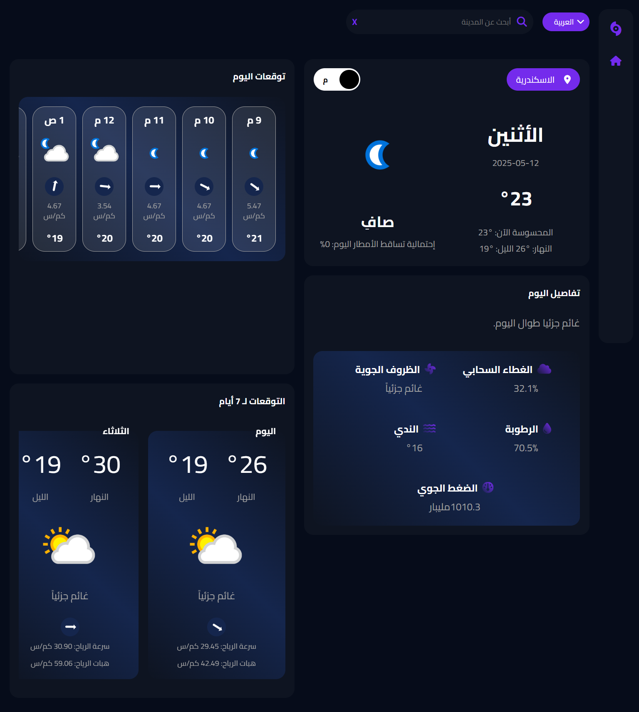

# Nile Forecast

تطبيق جافاسكريبت بسيط لعرض حالة الطقس في عدد من محافظات مصر باللغتين العربية والإنجليزية.


_واجهة الصفحة الرئيسية لتطبيق Nile Forecast_

## جدول المحتويات

- [ملخص المشروع](#ملخص-المشروع)
- [الميزات](#الميزات)
- [الاستخدام](#الاستخدام)
- [التقنيات المستخدمة](#التقنيات-المستخدمة)
- [التواصل](#التواصل)

## ملخص المشروع

**Nile Forecast** هو تطبيق ويب يعرض حالة الطقس الحالية والتوقعات للساعات والأيام القادمة في عدة مدن مصرية. التطبيق يدعم اللغتين العربية والإنجليزية، ويتيح عرض درجات الحرارة بالمئوية أو الفهرنهايت، مع تصميم سهل الاستخدام وأداء محسن.

## الميزات

- عرض حالة الطقس الفورية مع تحديث مستمر.
- دعم اللغتين العربية والإنجليزية.
- عرض درجات الحرارة بالمئوية أو الفهرنهايت.
- حفظ إعدادات المستخدم في `sessionStorage` لتجربة مستخدم سلسة.
- تصميم أنيق باستخدام **SCSS**.
- كود آمن ومنظم باستخدام **TypeScript** لتقليل الأخطاء.

## متطلبات النظام

- متصفح ويب حديث (Chrome، Firefox، Safari، إلخ.)
- اتصال بالإنترنت لجلب بيانات الطقس من واجهة برمجة التطبيقات (API)

## التثبيت

1. استنسخ المستودع:

   ```bash
   git clone https://github.com/username/nile-forecast.git
   ```

2. أنتقل إلي مجلد المشروع
   ```bash
   cd Weather-Status
   ```

- ملاحظة: تأكد من إعداد مفتاح API في ملف JavaScript الرئيسي (مثل Api.js) إذا لزم الأمر:

  ```bash
  const API_KEY = 'your_api_key_here'; // أضف مفتاح API الخاص بك من Visual Crossing
  ```

## الأستخدام

عند فتح التطبيق سيتم تحديد مدينة الأسكندرية تلقائياً ثم يمكنك تحديد المدينة التي تريدها من مجموعة مدن في مصر وما عليك إلا الأنتظار لتحميل البيانات الموثوقة لحالة الطقس والتي يمكنك الأعتماد عليها.

## التقنيات المستخدمة

- HTML
- SCSS
- Javascript
- Typescript
- Fontawesome
- API [From visualcrossing]

## التواصل

[Facebook](https://www.facebook.com/profile.php?id=100085749470017)
[X (Twitter)](https://x.com/ahmed_magdy135)
[LinkedIn](https://www.linkedin.com/in/ahmed-magdy-2a71881b1/)
